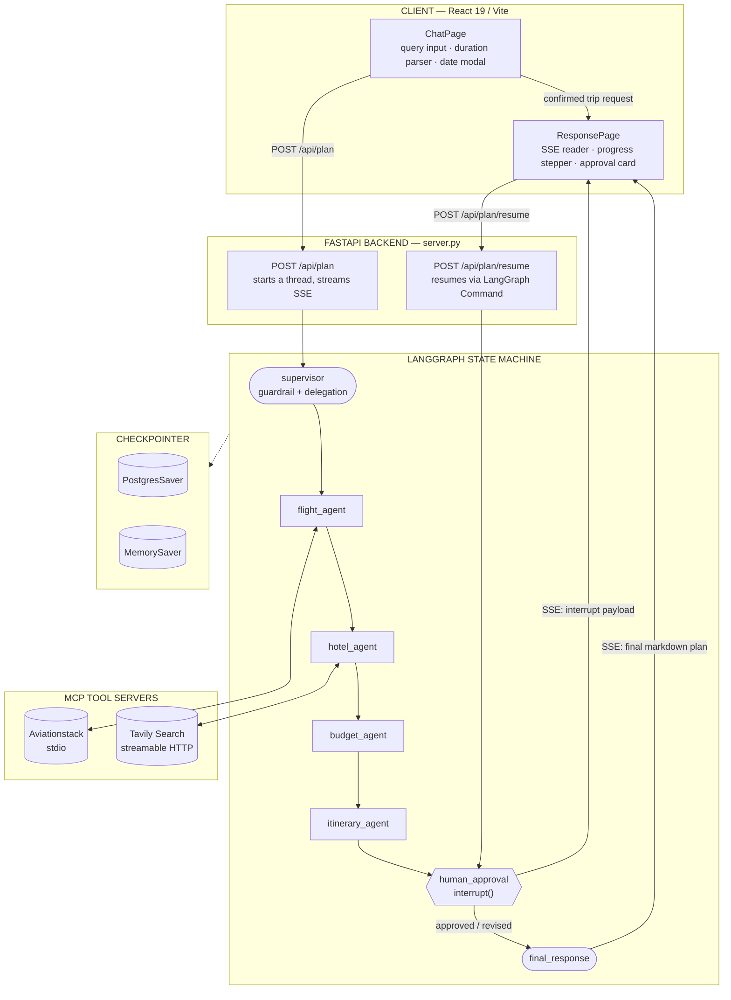

# GoVibe

**AI-native travel planning, orchestrated by agents, approved by you.**

GoVibe turns a single sentence like *"plan a 3 day trip to Manali from Delhi under 10,000 INR"* — into a fully researched, budget-checked, day-by-day itinerary. A team of specialized agents does the work; you stay in the loop before anything is final.

---

## Table of Contents

1. [Overview](#overview)
2. [Product Walkthrough](#product-walkthrough)
3. [Architecture](#architecture)
4. [Agent Orchestration](#agent-orchestration)
5. [MCP Integration](#mcp-integration)
6. [API Reference](#api-reference)
7. [Frontend](#frontend)
8. [Data Schemas](#data-schemas)
9. [Project Structure](#project-structure)
10. [Getting Started](#getting-started)
11. [Environment Variables](#environment-variables)

---

## Overview

GoVibe decomposes travel planning into discrete, coordinated agent responsibilities rather than one monolithic prompt:

| Stage | What happens |
|---|---|
| **Guardrail** | Validates the request is genuinely travel-related before any work starts |
| **Planning** | A supervisor agent extracts structured trip constraints and picks which specialists to run |
| **Flights** | Aviationstack MCP resolves airports, airlines, and route feasibility |
| **Stays** | Tavily Search MCP surfaces accommodations, neighborhoods, and live rates |
| **Budget** | Aggregated cost data is checked against the user's stated limit |
| **Itinerary** | Findings are synthesized into a structured, hour-by-hour schedule |
| **Human review** | Execution pauses — via a LangGraph interrupt — for approval or revision |
| **Final plan** | Feedback is folded in and a polished plan is returned, checklists included |

Built on LangGraph state-graph orchestration, native MCP tool integrations, SSE streaming for live progress, and a React frontend with a genuine human-in-the-loop checkpoint — not a rubber stamp.

---

## Product Walkthrough

Eight screens, one continuous flow — from a single sentence to an approved, checklist-ready itinerary. Full-resolution screenshots live in `assets/`.

<table>
<tr>
<td width="45%">

**1. Landing**
`ChatPage.jsx`

Full-screen video backdrop, the "Where do you want to go?" header, and a single free-text input — no forms, no fields to fill.

</td>
<td>


</td>
</tr>
<tr>
<td width="45%">

**2. Query → Duration**
`ChatPage.jsx`

*"3 day itinerary of Manali (from Delhi)... under 10000"* is parsed client-side — `extractDurationDays` resolves the phrase straight into a 3-day schedule.

</td>
<td>


</td>
</tr>
<tr>
<td width="45%">

**3. Trip Schedule**
`DatePickerModal.jsx`

Glassmorphic calendar modal — duration stepper, month navigation, and a departure/return summary bar (*Sat, Sep 19 → 3 Days → Mon, Sep 21*).

</td>
<td>


</td>
</tr>
<tr>
<td width="45%">

**4. Live Execution**
`ResponsePage.jsx`

A five-stage stepper — analyzing, flights, hotels, budget, itinerary — tracks real backend progress with a recap badge pinned above it.

</td>
<td>


</td>
</tr>
<tr>
<td width="45%">

**5. Human-in-the-Loop Review**
`ResponsePage.jsx`

The graph pauses here. Draft flight details (IndiGo 6E 1234, Delhi → Kullu) and transfer notes sit above two actions: *Suggest changes* or *Approve Plan*.

</td>
<td>


</td>
</tr>
<tr>
<td width="45%">

**6. Final Plan — Stay & Booking**
Final view

Accommodation table (Zostel Manali, Old Mall, shared dorm bed, INR 400/night) plus booking guidance and the start of the budget breakdown.

</td>
<td>


</td>
</tr>
<tr>
<td width="45%">

**7. Final Plan — Day-by-Day**
Final view

Hour-blocked schedule for each day — Day 1 alone runs from a 7:30 AM departure through a 10:30 PM dinner at a local dhaba.

</td>
<td>


</td>
</tr>
<tr>
<td width="45%">

**8. Quick Reference Checklist**
Final view

Documents, cash and payments, connectivity, and packing — grouped for a last check before departure, with *Plan Another Trip* to reset.

</td>
<td>


</td>
</tr>
</table>

---

## Architecture



**Reading the diagram:** the client never talks to the graph directly — every interaction is a stream. `/api/plan` opens a thread and runs until either the guardrail rejects the request or the graph hits `human_approval`. `/api/plan/resume` re-enters that exact paused state via LangGraph's `Command(resume=...)`, so no work upstream is repeated.

---

## Agent Orchestration

Defined in `backend/agents.py` (nodes) and `backend/main.py` (graph wiring), with shared state in `backend/state.py`.

### State — `TravelState`

```python
class TravelState(TypedDict, total=False):
    messages: Annotated[list[AnyMessage], operator.add]
    user_id: str
    user_query: str
    trip_constraints: dict[str, Any]
    selected_agents: list[str]
    supervisor_reasoning: str
    flight_results: str
    hotel_results: str
    budget_results: str
    itinerary: str
    approval_request: str
    human_feedback: str
    approved: bool
    final_response: str
    llm_calls: int
```

### Nodes

**`supervisor`**
Runs the input guardrail first — an LLM call returning `{"allowed": bool, "reason": str}`. A `false` short-circuits the graph straight to a rejection response. On `true`, it extracts `selected_agents`, structured `trip_constraints` (destination, origin, duration, budget, travel style, special preferences), and its own reasoning.

**`flight_agent`**
Calls `list_airports(destination, limit=10)` and `list_airlines("", limit=10)` over MCP, then prompts the LLM with those results to propose routes, durations, fares, and seasonal notes.

**`hotel_agent`**
Runs `tavily_search` for stays, neighborhoods, and availability matching the request; writes to `hotel_results`.

**`budget_agent`**
Reconciles flight and hotel findings against the stated cap, producing cost categories, risk flags, savings tips, and a feasibility score.

**`itinerary_agent`**
Merges all research into a structured, day-by-day draft and produces the `approval_request` payload for review.

**`human_approval`**
Pauses the graph with `interrupt()`:

```python
interrupt({
    "question": "Do you approve this itinerary?",
    "draft_itinerary": state.get("itinerary", ""),
    "approval_request": state.get("approval_request", ""),
    "expected_response": {
        "approved": True,
        "feedback": "Optional feedback for revision",
    },
})
```

**`final_response`**
Resumes via `Command(resume={"approved": ..., "feedback": ...})`. Approval produces the finished markdown plan; feedback triggers a targeted rewrite instead of a full restart.

### Routing

- `AGENT_ORDER = ["flight_agent", "hotel_agent", "budget_agent", "itinerary_agent"]`
- `route_from_supervisor` enters at the first selected agent in that order.
- `route_after_agent(current)` advances to the next *selected* agent, skipping any that weren't requested; if none remain, it falls through to `itinerary_agent`.
- `itinerary_agent` always leads to `human_approval`, which always leads to `final_response`, which always leads to `END`.

---

## MCP Integration

Implemented in `backend/mcp_client.py` via `langchain_mcp_adapters.client.MultiServerMCPClient`, wiring two transports:

```python
MultiServerMCPClient({
    "tavily": {
        "transport": "streamable_http",
        "url": f"https://mcp.tavily.com/mcp/?tavilyApiKey={tavily_api_key}"
    },
    "aviationstack": {
        "transport": "stdio",
        "command": sys.executable,
        "args": ["-m", "aviationstack_mcp", "mcp", "run"],
        "env": {"AVIATION_STACK_API_KEY": aviation_api_key}
    }
})
```

| Server | Transport | Role |
|---|---|---|
| **Tavily** | Streamable HTTP | Real-time web search for hotels, neighborhoods, and pricing via `tavily_search` |
| **Aviationstack** | stdio (local subprocess) | Airport and airline registry lookups via `list_airports` / `list_airlines` |

---

## API Reference

### `POST /api/plan`
Starts a new planning thread and streams progress.

```json
{
  "query": "plan a 3 day itinerary of Manali (from Delhi) including flight, hotels...",
  "start_date": "Sat, Sep 19, 2026",
  "end_date": "Mon, Sep 21, 2026",
  "duration_days": 3
}
```
Response: `text/event-stream`

### `POST /api/plan/resume`
Resumes a paused thread after human review.

```json
{
  "thread_id": "8f8b8538-6cf4-44b4-8fe4-c782782e5b72",
  "approved": true,
  "feedback": ""
}
```
Response: `text/event-stream`

### SSE Event Types

| Event | Payload | Meaning |
|---|---|---|
| `session` | `{ thread_id }` | A new execution session has started |
| `agent_done` | `{ agent, label }` | An agent node has finished |
| `interrupt` | `{ thread_id, data: { itinerary, question, approval_request } }` | Graph is paused at `human_approval`, awaiting input |
| `final` | `{ data: "<markdown>" }` | Guardrail rejection, or completed final plan |
| `error` | `{ message }` | An exception occurred during execution |
| `done` | — | Stream has closed |

---

## Frontend

React 19 + Vite + React Router v7, styled as a dark, glassmorphic interface — custom SVG iconography throughout, no emoji.

### Routes (`frontend/src/App.jsx`)

| Route | Component | Purpose |
|---|---|---|
| `/` | `ChatPage` | Landing and trip input |
| `/response` | `ResponsePage` | Progress monitor, approval console, final plan |

### Components

- **`ChatPage.jsx`** — full-bleed looping video background; `extractDurationDays(text)` parses phrases like `3 days`, `2 nights`, `weekend` (→ 3), `1 week` (→ 7), and spelled-out numbers; submission opens `DatePickerModal` pre-filled with the parsed duration.
- **`DatePickerModal.jsx`** — glassmorphic scheduling modal with a duration stepper, month-navigable calendar, past-date disabling, and start/end range highlighting.
- **`ResponsePage.jsx`** — reads the SSE stream via `fetch` + `TextDecoder`; renders the live stepper, the query/date recap badge, the human-in-the-loop card (`react-markdown` + `remark-gfm` + `rehype-raw`) with revise/approve actions, and the final plan with a reset control.

---

## Data Schemas

### Supervisor Output

```json
{
  "selected_agents": ["flight_agent", "hotel_agent", "budget_agent", "itinerary_agent"],
  "trip_constraints": {
    "destination": "Manali",
    "origin": "Delhi",
    "duration": "3 days",
    "budget": "10000",
    "travel_style": "budget",
    "special_preferences": ["Zostels"]
  },
  "reasoning": "User requested flights from Delhi to Manali, budget stays (Zostels), and an overall budget cap of 10000 INR."
}
```

### Input Guardrail

```json
{
  "allowed": true,
  "reason": ""
}
```

---

## Project Structure

```
GoVibe/
├── backend/
│   ├── .env
│   ├── agents.py           Supervisor, specialist agents, guardrails
│   ├── config.py           LLM initialization and environment keys
│   ├── main.py             LangGraph builder and CLI runner
│   ├── mcp_client.py       MultiServerMCPClient (Aviationstack + Tavily)
│   ├── requirements.txt
│   ├── server.py           FastAPI app and SSE endpoints
│   └── state.py            TravelState definition
│
├── frontend/
│   ├── index.html
│   ├── package.json
│   ├── vite.config.js
│   └── src/
│       ├── App.jsx
│       ├── App.css
│       ├── index.css
│       ├── main.jsx
│       └── components/
│           ├── ChatPage.jsx / .css
│           ├── DatePickerModal.jsx / .css
│           └── ResponsePage.jsx / .css
│
└── README.md
```

---

## Getting Started

### Prerequisites

- Python 3.10+
- Node.js 18+
- Groq API key
- Tavily API key
- Aviationstack API key *(optional — gracefully mocked if absent)*
- PostgreSQL URL *(optional — falls back to in-memory checkpointing)*

### Backend

```bash
cd backend
python3 -m venv venv
source venv/bin/activate        # Windows: .\venv\Scripts\Activate.ps1

pip install -r requirements.txt
pip install aviationstack-mcp   # only if using live flight data

python -m uvicorn server:app --reload --host 0.0.0.0 --port 8000
```

Backend runs at `http://localhost:8000`.

### Frontend

```bash
cd frontend
npm install
npm run dev
```

Frontend runs at `http://localhost:5173`.

---

## Environment Variables

`backend/.env`:

```ini
# Groq
GROQ_API_KEY=your_groq_api_key_here
GROQ_MODEL=openai/gpt-oss-20b

# MCP tool keys
TAVILY_API_KEY=your_tavily_api_key_here
AVIATIONSTACK_API_KEY=your_aviationstack_api_key_here
OPENWEATHER_API_KEY=your_openweather_api_key_here

# Persistence (optional — empty falls back to MemorySaver)
DATABASE_URL=
```

---

*GoVibe pairs structured multi-agent reasoning with a real human checkpoint — MCP-driven research, LangGraph orchestration, and SSE streaming, all in service of a plan you actually approved.*